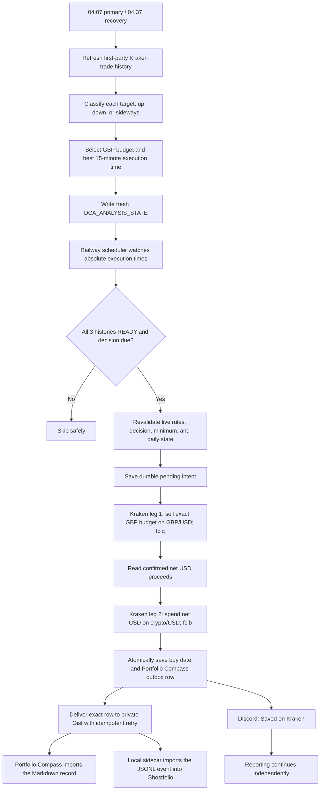
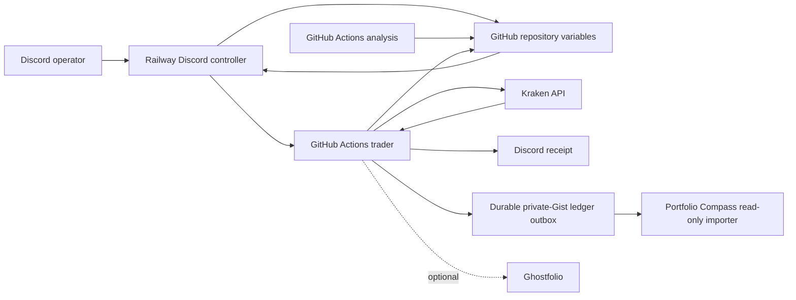

# Kraken GBP-Funded USD DCA Bot

> [!IMPORTANT]
> **Start here:** [DCA Bot Operating and Configuration Guide](00_START_HERE.md)
> contains the everyday Discord commands, direct app links, current GBP budgets,
> JSON ownership rules, pair-change procedure, and troubleshooting steps.

This repository is the production source for a fail-closed Kraken spot DCA
service. It tracks and buys exactly these markets:

- `BTC/GBP` (spends GBP directly)
- `HYPE/USD`
- `SOL/GBP` (spends GBP directly)

Budgets remain denominated in GBP. At execution time the bot first sells the
selected GBP budget on Kraken's `GBP/USD` market, then spends the confirmed net
USD proceeds on the selected crypto/USD market. There is no THB or Bitkub path.

Kraken is the authoritative record of cash, holdings, fees, and orders. Every
confirmed purchase is also placed in a durable, retry-safe outbox for Portfolio
Compass's read-only private-Gist adapter. A Gist outage cannot repeat a Kraken
order; the exact ledger row remains queued until it is delivered. Ghostfolio is
a reporting-only local mirror and can never affect analysis, budgets, scheduling,
or Kraken execution.

> [!WARNING]
> Recovery defaults to `DCA_TRADING_MODE=shadow`. Production scheduling remains
> paused until the 65-day Kraken bootstrap reports verified `READY` coverage for
> all three pairs and a full shadow cycle passes. The missed 7 August purchase
> is intentionally not replayed.

## Production configuration

The strict production trading gate is **2026-08-07 in Asia/Bangkok**. The
repository variable `DCA_START_DATE` contains `2026-08-07`; before that local
date, the trader fails closed without creating either Kraken order. Check live
operation with `show status` and `!dca health` rather than treating this static
baseline as current runtime state.

The requested enabled rules are:

```json
{
  "BTC_GBP": {
    "REGIME_AMOUNTS_GBP": {"LOW": 10, "UP": 20},
    "BUY_ENABLED": true
  },
  "HYPE_USD": {
    "REGIME_AMOUNTS_GBP": {"LOW": 10, "UP": 15},
    "BUY_ENABLED": true
  },
  "SOL_GBP": {
    "REGIME_AMOUNTS_GBP": {"LOW": 5, "UP": 15},
    "BUY_ENABLED": true
  }
}
```

The stored `LOW` and `UP` fields are the lower and upper budget endpoints; the
`UP` field name is retained for configuration compatibility and no longer means
"use this in an uptrend." The counter-cyclical policy is:

- `DOWNTREND` → higher endpoint: BTC £20, HYPE £15, SOL £15; £50 aggregate.
- `SIDEWAYS` → midpoint: BTC £15, HYPE £12.50, SOL £10; £37.50 aggregate.
- `UPTREND` → lower endpoint: BTC £10, HYPE £10, SOL £5; £25 aggregate.

Each enabled asset can buy at most once per Bangkok calendar day.

## Automated daily flow



`fciq` requests the GBP/USD fee in quote currency; `fcib` requests the crypto
order fee in the purchased base asset. The bot uses confirmed Kraken fills—not
an estimated conversion—to determine how much USD is available for leg two.

If either result is unknown, the durable intent remains pending and later runs
reconcile it before considering another order. The bot never starts a second
funding leg merely because an API response was interrupted.

## Trend and timing decisions

Analysis runs at 04:07 Bangkok with an idempotent 04:37 recovery and uses
completed Kraken candles only. Railway independently checks after 04:20 and
dispatches a missing analysis when GitHub has no queued or active run.

- `UPTREND`: two consecutive daily closes above SMA150, EMA20 above EMA50,
  completed weekly close above weekly EMA20, and a positive 20-day SMA150 slope.
- `DOWNTREND`: the inverse conditions.
- `SIDEWAYS`: every other valid result.
- `DOWNTREND` selects `HIGH`, `SIDEWAYS` selects `MID`, and `UPTREND`
  selects `LOW`.

`MID` is derived from the two configured endpoints as `(LOW + UP) / 2` and is
rounded to the nearest penny using half-up currency rounding. The configured
lower endpoint cannot exceed the upper endpoint.

The execution-time engine deterministically evaluates 3-, 5-, 7-, 14-, 30-,
45-, and 60-day Bangkok-day windows at 15-minute resolution for the actual
Kraken routes: BTC/GBP, HYPE/USD, and SOL/GBP. It minimizes median closing
price miss from each day's absolute low, measures wins within 0.5%, applies the
locked 14-day override and 30-versus-60 thresholds, and resolves close candidates
using Top-5 appearances across all seven windows, 60-day win rate, then earlier
local time. The 3/5/7-day windows therefore influence consistency but cannot by
themselves displace the stable long-window threshold result. Gemini may
explain the result but cannot choose, change, or block it.

History is built exclusively from Kraken's first-party PostTrade API into
append-only monthly Gist partitions. The resumable bootstrap checkpoints every
page, globally rate-limits requests, records explicit no-trade gaps and partition
hashes, and verifies the overlapping recent 7.5 days against Kraken OHLC. No new
order is permitted unless BTC/GBP, HYPE/USD, and SOL/GBP all have current,
verified history and decisions.

PostTrade pagination uses Kraken's exclusive `from_ts` cursor without subtracting
time. Boundary trade IDs are deduplicated after nanosecond timestamps are
normalized to Python microseconds; trades older than the active cursor are
discarded. This prevents page-boundary executions being counted twice and is
required for the OHLC overlap check to pass.

If analysis finishes after its selected time, the explicit legacy catch-up time
is 05:00 Bangkok and is usable only through 06:00. Normal selections retain the
one-hour recovery window. Expired decisions are never replayed.

Insufficient, stale, missing, or failed analysis sets that target to `ERROR`,
alerts Discord, and skips the purchase. Old decisions are never reused.

## Architecture



Railway runs `python3 -u discord_bot.py` continuously. It owns the five-minute
scheduler and dispatches GitHub Actions at each asset's absolute decision time.
GitHub Actions performs public Kraken candle analysis, protected configuration
writes, authenticated portfolio checks, and trading. Kraken credentials remain
inside GitHub Actions. Discord can be closed on every phone and computer without
stopping automation.

## State and runtime configuration

`DCA_TARGET_MAP` contains only the three exact target keys, their lower `LOW`
and upper `UP` GBP endpoints, and `BUY_ENABLED` flags. Budget edits are atomic
and permitted only while the selected asset is disabled. `MID` and `HIGH` are
derived analysis tiers, not extra fields in this user-owned JSON.

`DCA_ANALYSIS_STATE` stores each asset's status, regime, selected tier,
`EXECUTE_AT`, `VALID_UNTIL`, `DECISION_ID`, `RULES_HASH`, signal metrics, and
timing metrics.

`DCA_EXECUTION_STATE` stores `LAST_BUY_DATE`, durable `PENDING_ORDER` state, and
FIFO `PENDING_GIST_DELIVERIES`. Completion atomically moves confirmed fill
evidence into that delivery queue before the pending Kraken intent is cleared.
The state is size-bounded and new orders reserve delivery capacity before
submission.

Required repository variables:

- `DCA_TARGET_MAP`
- `DCA_ANALYSIS_STATE`
- `DCA_EXECUTION_STATE`
- `DCA_START_DATE` (`2026-08-07` for this rollout)
- `TIMEZONE` (`Asia/Bangkok`)
- `DCA_TRADING_MODE` (`shadow`, `canary`, or `live`; default `shadow`)
- `DCA_CANARY_SYMBOL` (`SOL_GBP`)
- `DCA_HISTORY_GIST_ID` (dedicated private history Gist)

`DCA_CRON_ENABLED` is a Railway runtime variable, not a GitHub repository
variable. It must be `true` for normal scheduling and should be set to `false`
only during controlled maintenance. See the [operating guide](00_START_HERE.md) for
the direct Railway variables link and the safe pause/resume procedure.

Required Railway runtime variables:

- `DISCORD_BOT_TOKEN` (secret)
- `GH_PAT` (secret; Railway controller token, distinct from `GH_PAT_FOR_VARS`)
- `GITHUB_REPO` (`aesscialo-bot/DCA-Bot`)
- `GITHUB_WORKFLOW_REF` (`main`)
- `DISCORD_CHANNEL_ID`
- `DISCORD_ALLOWED_USERS`
- `DCA_CRON_ENABLED` (`true` for normal operation)
- `TIMEZONE` (`Asia/Bangkok`, matching the GitHub repository variable)
- `DCA_TRADING_MODE` (must match the repository variable)
- `DCA_CANARY_SYMBOL` (`SOL_GBP`)
- `GIST_ID` and `GIST_TOKEN` for receipt-aware status

Railway may also contain `GEMINI_API_KEY` for optional read-only conversational
intent classification. Exact DCA control commands never depend on AI.

Optional repository variables:

- `GHOSTFOLIO_URL`
- `PORTFOLIO_ACCOUNT_MAP`

Required GitHub Actions secrets:

- `KRAKEN_API_KEY`
- `KRAKEN_API_SECRET`
- `DISCORD_WEBHOOK_URL`
- `GH_PAT_FOR_VARS`

Optional secrets:

- `GEMINI_API_KEY`
- `GIST_ID`
- `GIST_TOKEN`
- `GHOSTFOLIO_TOKEN`

Kraken API credentials must allow query and order operations but must never have
withdrawal permission. Production JSON state is loaded inside workflow steps,
masked line-by-line, and passed through the GitHub environment file. Workflows
must never print a complete rules, analysis, or execution-state document.

## Discord controls

Examples use the canonical mixed-market targets:

```text
!dca set BTC amounts to 10 low and 20 high
!dca disable BTC
!dca enable BTC
!dca confirm enable BTC_GBP
!dca analyze BTC
!dca analyze all
show status
!dca health
```

Budget changes require the target to be disabled. Enabling requires exact
confirmation and displays the lower, midpoint, and higher amounts, the latest
regime, effective amount, next execution time, decision age, and aggregate
maximum daily exposure.

## Workflows

| Workflow | Trigger | Responsibility |
| --- | --- | --- |
| `crypto_analysis.yml` | 04:07 and 04:37 Bangkok or manual | Refresh strict Kraken history and build idempotent deterministic decisions. |
| `kraken_history_bootstrap.yml` | Manual | Resume the 65-day PostTrade history bootstrap and publish verified partitions. |
| `daily_dca.yml` | Minutes 02/17/32/47 plus Railway | Revalidate the global history gate and execute due two-leg purchases exactly once. |
| `portfolio_check.yml` | Monthly or manual | Read-only Kraken holdings and mixed-market history, valued in GBP with live Kraken GBP/USD where required. |
| `update_dca_config.yml` | Manual/Discord dispatch | Serialize atomic GBP budget and enable-state updates. |
| `ci.yml` | Pull request and `main` | Compile, test, validate workflows, and build the Railway image. |

## Structural migration or recovery verification

Do not reuse a historical start date, clear execution state, or delete a target
key as a shortcut. A structural migration or recovery must begin with every
target disabled, Railway scheduling off, and an authenticated Kraken open/closed
order audit confirming that no unresolved intent can be lost. Preserve valid
buy dates and recovery records while migrating complete rules, analysis, and
execution state.

The guarded maintainer procedure is in
[Adding or permanently removing a pair](00_START_HERE.md#adding-or-permanently-removing-a-pair).
Use the everyday Discord procedure in that guide for routine budget or enable
changes.

Acceptance requires no pending intents, no same-day duplicate orders, a fresh
decision for every canonical target, and no credential or complete production
state JSON in public logs. No manual intervention is required after activation.

## Local Ghostfolio

The isolated `dca-ghostfolio` Compose project pins Ghostfolio 3.43.0 and keeps
PostgreSQL 15 and Redis off host ports. Only `127.0.0.1:3333` is exposed. The
no-port sync sidecar has no Kraken credentials and polls the durable Gist every
five minutes. Secrets live under `%LOCALAPPDATA%\dca-ghostfolio`, outside Git,
with user-only ACLs.

```powershell
$env:DCA_GHOSTFOLIO_SECRETS_FILE="$env:LOCALAPPDATA\dca-ghostfolio\secrets.env"
docker compose -f .\ghostfolio\compose.yml ps
.\ghostfolio\backup-and-restore-test.ps1
```

Confirmed DCA fills are appended as signed `PortfolioEventV3` records and the
localhost sidecar imports them every five minutes without Kraken credentials.
An independent GitHub workflow publishes a signed Kraken holdings snapshot at
minutes 11 and 41. The sidecar audits that snapshot for quantity drift. Initial
or externally-created holdings are reconciled only by the explicit, idempotent
`reconcile-holdings` command, which records opening-balance BUY/SELL adjustments
at the Kraken snapshot price and publishes a receipt; normal DCA fills always
retain their exact order-level cost and fee records.

Ghostfolio 3.43.0 imports BTC and SOL through CoinGecko. Its local CoinGecko
importer rejects Hyperliquid despite returning it in lookup results, so HYPE is
bound explicitly to Ghostfolio's supported Yahoo profile `HYPE32196USD`.

`ghostfolio/reconcile_legacy.py` is dry-run only. It maps recovered trades to
fresh logical accounts and blocks migration if the hosted export is missing or
any exact-match conflict exists. Portfolio Compass remains independently fed by
the existing Markdown ledger.

## Local verification

```bash
python -m compileall -q .
python -m unittest discover -s tests -v
docker build --tag dca-bot-local .
```
