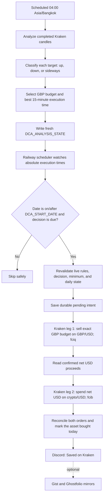
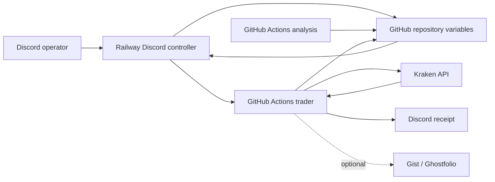

# Kraken GBP-Funded USD DCA Bot

> [!IMPORTANT]
> **Start here:** [DCA Bot Operating and Configuration Guide](00_START_HERE.md)
> contains the everyday Discord commands, direct app links, current GBP budgets,
> JSON ownership rules, pair-change procedure, and troubleshooting steps.
>
> **Current budget direction:** downtrend uses the higher endpoint, sideways uses
> the automatically derived midpoint, and uptrend uses the lower endpoint.

This repository is the production source for a fully automated Kraken spot DCA
service. It tracks and buys exactly these USD markets:

- `BTC/USD`
- `HYPE/USD`
- `SOL/USD`

Budgets remain denominated in GBP. At execution time the bot first sells the
selected GBP budget on Kraken's `GBP/USD` market, then spends the confirmed net
USD proceeds on the selected crypto/USD market. There is no THB or Bitkub path.

Kraken is the authoritative record of cash, holdings, fees, and orders. Gist and
Ghostfolio are optional post-fill mirrors; an unavailable optional logger never
means the Kraken portfolio was not saved.

## Production configuration

The strict production trading gate is **2026-08-07 in Asia/Bangkok**. The
repository variable `DCA_START_DATE` contains `2026-08-07`; before that local
date, the trader fails closed without creating either Kraken order. Check live
operation with `show status` and `!dca health` rather than treating this static
baseline as current runtime state.

The requested enabled rules are:

```json
{
  "BTC_USD": {
    "REGIME_AMOUNTS_GBP": {"LOW": 10, "UP": 20},
    "BUY_ENABLED": true
  },
  "HYPE_USD": {
    "REGIME_AMOUNTS_GBP": {"LOW": 10, "UP": 15},
    "BUY_ENABLED": true
  },
  "SOL_USD": {
    "REGIME_AMOUNTS_GBP": {"LOW": 5, "UP": 15},
    "BUY_ENABLED": true
  }
}
```

The stored `LOW` and `UP` fields are the lower and upper budget endpoints; the
`UP` field name is retained for configuration compatibility and no longer means
"use this in an uptrend." The counter-cyclical policy is:

- `DOWNTREND` → higher endpoint: BTC £20, HYPE £15, SOL £15; £50 aggregate.
- `SIDEWAYS` → midpoint: BTC £15, HYPE £12.50, SOL £10; £37.50 aggregate.
- `UPTREND` → lower endpoint: BTC £10, HYPE £10, SOL £5; £25 aggregate.

Each enabled asset can buy at most once per Bangkok calendar day.

## Automated daily flow



`fciq` requests the GBP/USD fee in quote currency; `fcib` requests the crypto
order fee in the purchased base asset. The bot uses confirmed Kraken fills—not
an estimated conversion—to determine how much USD is available for leg two.

If either result is unknown, the durable intent remains pending and later runs
reconcile it before considering another order. The bot never starts a second
funding leg merely because an API response was interrupted.

## Trend and timing decisions

Analysis is scheduled daily for 04:00 Asia/Bangkok (21:00 UTC) and uses
completed Kraken candles only. GitHub may queue or start the workflow a few
minutes after the scheduled time.

- `UPTREND`: two consecutive daily closes above SMA150, EMA20 above EMA50,
  completed weekly close above weekly EMA20, and a positive 20-day SMA150 slope.
- `DOWNTREND`: the inverse conditions.
- `SIDEWAYS`: every other valid result.
- `DOWNTREND` selects `HIGH`, `SIDEWAYS` selects `MID`, and `UPTREND`
  selects `LOW`.

`MID` is derived from the two configured endpoints as `(LOW + UP) / 2` and is
rounded to the nearest penny using half-up currency rounding. The configured
lower endpoint cannot exceed the upper endpoint.

The execution-time engine deterministically evaluates completed 15-minute data
over 3-, 5-, and 7-day windows. A decision contains an absolute `EXECUTE_AT`, is
valid only for its stated window, and must be at least 30 minutes after analysis.
Gemini Flash-Lite optionally explains the deterministic Python result. If it is
unavailable, the decision is unchanged; Gemini cannot choose the regime,
budget, or time.

Insufficient, stale, missing, or failed analysis sets that target to `ERROR`,
alerts Discord, and skips the purchase. Old decisions are never reused.

## Architecture



Railway runs `python3 -u discord_bot.py` continuously. It owns the five-minute
scheduler and dispatches GitHub Actions at each asset's absolute decision time.
GitHub Actions performs public Kraken candle analysis, protected configuration
writes, authenticated portfolio checks, and trading. Kraken credentials remain
inside GitHub Actions. Discord can be closed on every phone and computer without
stopping automation.

## State and runtime configuration

`DCA_TARGET_MAP` contains only the three exact target keys, their lower `LOW`
and upper `UP` GBP endpoints, and `BUY_ENABLED` flags. Budget edits are atomic
and permitted only while the selected asset is disabled. `MID` and `HIGH` are
derived analysis tiers, not extra fields in this user-owned JSON.

`DCA_ANALYSIS_STATE` stores each asset's status, regime, selected tier,
`EXECUTE_AT`, `VALID_UNTIL`, `DECISION_ID`, `RULES_HASH`, signal metrics, and
timing metrics.

`DCA_EXECUTION_STATE` stores `LAST_BUY_DATE` and durable `PENDING_ORDER` state,
including the originating decision and both legs of the GBP-funded USD purchase.

Required repository variables:

- `DCA_TARGET_MAP`
- `DCA_ANALYSIS_STATE`
- `DCA_EXECUTION_STATE`
- `DCA_START_DATE` (`2026-08-07` for this rollout)
- `TIMEZONE` (`Asia/Bangkok`)

`DCA_CRON_ENABLED` is a Railway runtime variable, not a GitHub repository
variable. It must be `true` for normal scheduling and should be set to `false`
only during controlled maintenance. See the [operating guide](00_START_HERE.md) for
the direct Railway variables link and the safe pause/resume procedure.

Required Railway runtime variables:

- `DISCORD_BOT_TOKEN` (secret)
- `GH_PAT` (secret; Railway controller token, distinct from `GH_PAT_FOR_VARS`)
- `GITHUB_REPO` (`aesscialo-bot/DCA-Bot`)
- `GITHUB_WORKFLOW_REF` (`main`)
- `DISCORD_CHANNEL_ID`
- `DISCORD_ALLOWED_USERS`
- `DCA_CRON_ENABLED` (`true` for normal operation)
- `TIMEZONE` (`Asia/Bangkok`, matching the GitHub repository variable)

Railway may also contain `GEMINI_API_KEY` for optional read-only conversational
intent classification. Exact DCA control commands never depend on AI.

Optional repository variables:

- `GHOSTFOLIO_URL`
- `PORTFOLIO_ACCOUNT_MAP`

Required GitHub Actions secrets:

- `KRAKEN_API_KEY`
- `KRAKEN_API_SECRET`
- `DISCORD_WEBHOOK_URL`
- `GH_PAT_FOR_VARS`

Optional secrets:

- `GEMINI_API_KEY`
- `GIST_ID`
- `GIST_TOKEN`
- `GHOSTFOLIO_TOKEN`

Kraken API credentials must allow query and order operations but must never have
withdrawal permission. Production JSON state is loaded inside workflow steps,
masked line-by-line, and passed through the GitHub environment file. Workflows
must never print a complete rules, analysis, or execution-state document.

## Discord controls

Examples use canonical USD targets:

```text
!dca set BTC amounts to 10 low and 20 high
!dca disable BTC
!dca enable BTC
!dca confirm enable BTC_USD
!dca analyze BTC
!dca analyze all
show status
!dca health
```

Budget changes require the target to be disabled. Enabling requires exact
confirmation and displays the lower, midpoint, and higher amounts, the latest
regime, effective amount, next execution time, decision age, and aggregate
maximum daily exposure.

## Workflows

| Workflow | Trigger | Responsibility |
| --- | --- | --- |
| `crypto_analysis.yml` | Scheduled 04:00 Bangkok or manual | Build fresh decisions for BTC/USD, HYPE/USD, and SOL/USD; GitHub may start a scheduled run a few minutes late. |
| `daily_dca.yml` | Railway dispatch | Enforce `DCA_START_DATE`, revalidate state, and execute due two-leg purchases. |
| `portfolio_check.yml` | Monthly or manual | Read-only Kraken holdings and USD-market history, valued in GBP with live Kraken GBP/USD. |
| `update_dca_config.yml` | Manual/Discord dispatch | Serialize atomic GBP budget and enable-state updates. |
| `ci.yml` | Pull request and `main` | Compile, test, validate workflows, and build the Railway image. |

## Structural migration or recovery verification

Do not reuse a historical start date, clear execution state, or delete a target
key as a shortcut. A structural migration or recovery must begin with every
target disabled, Railway scheduling off, and an authenticated Kraken open/closed
order audit confirming that no unresolved intent can be lost. Preserve valid
buy dates and recovery records while migrating complete rules, analysis, and
execution state.

The guarded maintainer procedure is in
[Adding or permanently removing a pair](00_START_HERE.md#adding-or-permanently-removing-a-pair).
Use the everyday Discord procedure in that guide for routine budget or enable
changes.

Acceptance requires no pending intents, no same-day duplicate orders, a fresh
decision for every canonical target, and no credential or complete production
state JSON in public logs. No manual intervention is required after activation.

## Local verification

```bash
python -m compileall -q .
python -m unittest discover -s tests -v
docker build --tag dca-bot-local .
```
