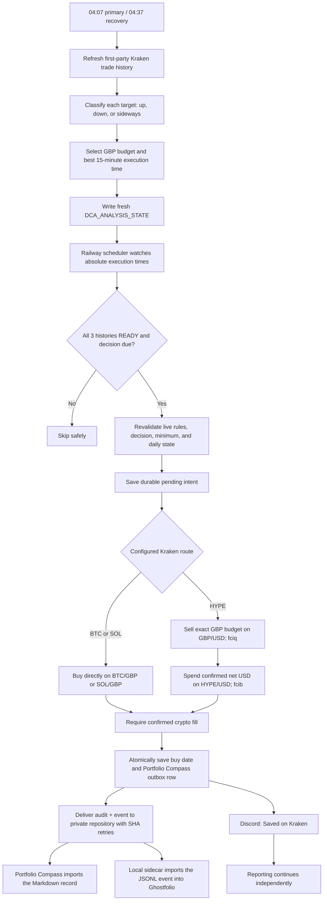
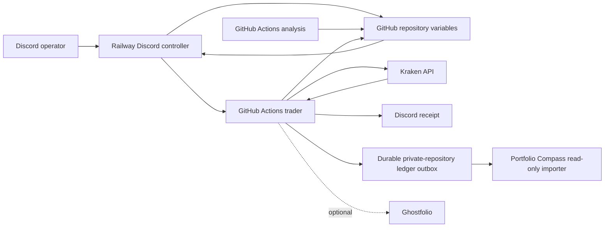

# Kraken GBP-Budgeted Mixed-Market DCA Bot

> [!IMPORTANT]
> **Start here:** [DCA Bot Operating and Configuration Guide](00_START_HERE.md)
> contains the everyday Discord commands, direct app links, current GBP budgets,
> JSON ownership rules, pair-change procedure, and troubleshooting steps.

This repository is the production source for a fail-closed Kraken spot DCA
service. It tracks and buys exactly these markets:

- `BTC/GBP` (spends GBP directly)
- `HYPE/USD`
- `SOL/GBP` (spends GBP directly)

Budgets remain denominated in GBP. BTC and SOL spend GBP directly on `BTC/GBP`
and `SOL/GBP`. HYPE is the sole USD route: the bot sells its exact GBP budget on
Kraken `GBP/USD`, then spends only the confirmed net USD proceeds on `HYPE/USD`.
There is no THB or Bitkub trading path.

Kraken is the authoritative record of cash, holdings, fees, and orders. Every
confirmed purchase is also placed in a durable, retry-safe outbox for Portfolio
Compass's read-only private-repository adapter. A repository outage cannot
repeat a Kraken order; the exact delivery evidence remains queued until both
audit and event artifacts are confirmed. Ghostfolio is a reporting-only local
mirror and can never affect analysis, budgets, scheduling, or Kraken execution.

> [!WARNING]
> Recovery defaults to `DCA_TRADING_MODE=shadow`. Production scheduling remains
> paused until the 65-day Kraken bootstrap reports verified `READY` coverage for
> all three pairs and a full shadow cycle passes. The missed 7 August purchase
> is intentionally not replayed.

## Production configuration

The strict production trading gate is **2026-08-07 in Asia/Bangkok**. The
repository variable `DCA_START_DATE` contains `2026-08-07`; before that local
date, the trader fails closed without creating either Kraken order. Check live
operation with `show status` and `!dca health` rather than treating this static
baseline as current runtime state.

The requested enabled rules are:

```json
{
  "BTC_GBP": {
    "REGIME_AMOUNTS_GBP": {"LOW": 12.5, "UP": 25},
    "BUY_ENABLED": true
  },
  "HYPE_USD": {
    "REGIME_AMOUNTS_GBP": {"LOW": 12.5, "UP": 18.75},
    "BUY_ENABLED": true
  },
  "SOL_GBP": {
    "REGIME_AMOUNTS_GBP": {"LOW": 12.5, "UP": 18.75},
    "BUY_ENABLED": true
  }
}
```

The stored `LOW` and `UP` fields are the lower and upper budget endpoints; the
`UP` field name is retained for configuration compatibility and no longer means
"use this in an uptrend." The counter-cyclical policy is:

- `DOWNTREND` → higher endpoint: BTC £25, HYPE £18.75, SOL £18.75; £62.50 aggregate.
- `SIDEWAYS` → midpoint: BTC £18.75, HYPE £15.63, SOL £15.63; £50.01 aggregate.
- `UPTREND` → lower endpoint: BTC £12.50, HYPE £12.50, SOL £12.50; £37.50 aggregate.

Each enabled asset can buy at most once per Bangkok calendar day.

## Automated daily flow



For HYPE, `fciq` requests the GBP/USD fee in quote currency and `fcib` requests
the HYPE fee in the purchased base asset. The bot uses confirmed Kraken
fills—not an estimated conversion—to determine how much USD is available for
that second leg. BTC and SOL have no funding leg or USD conversion fee.

If either result is unknown, the durable intent remains pending and later runs
reconcile it before considering another order. The bot never starts a second
funding leg merely because an API response was interrupted.

## Trend and timing decisions

Analysis runs at 04:07 Bangkok with an idempotent 04:37 recovery and uses
completed Kraken candles only. Railway independently checks after 04:20 and
dispatches a missing analysis when GitHub has no queued or active run.

- `UPTREND`: two consecutive daily closes above SMA150, EMA20 above EMA50,
  completed weekly close above weekly EMA20, and a positive 20-day SMA150 slope.
- `DOWNTREND`: the inverse conditions.
- `SIDEWAYS`: every other valid result.
- `DOWNTREND` selects `HIGH`, `SIDEWAYS` selects `MID`, and `UPTREND`
  selects `LOW`.

`MID` is derived from the two configured endpoints as `(LOW + UP) / 2` and is
rounded to the nearest penny using half-up currency rounding. The configured
lower endpoint cannot exceed the upper endpoint.

The execution-time engine deterministically evaluates 3-, 5-, 7-, 14-, 30-,
45-, and 60-day Bangkok-day windows at 15-minute resolution for the actual
Kraken routes: BTC/GBP, HYPE/USD, and SOL/GBP. It minimizes median closing
price miss from each day's absolute low, measures wins within 0.5%, applies the
locked 14-day override and 30-versus-60 thresholds, and resolves close candidates
using Top-5 appearances across all seven windows, 60-day win rate, then earlier
local time. The 3/5/7-day windows therefore influence consistency but cannot by
themselves displace the stable long-window threshold result. Gemini may
explain the result but cannot choose, change, or block it.

History is built exclusively from Kraken's first-party PostTrade API into
append-only monthly Gist partitions. The resumable bootstrap checkpoints every
page, globally rate-limits requests, records explicit no-trade gaps and partition
hashes, and verifies the overlapping recent 7.5 days against Kraken OHLC. No new
order is permitted unless BTC/GBP, HYPE/USD, and SOL/GBP all have current,
verified history and decisions.

PostTrade pagination uses Kraken's exclusive `from_ts` cursor without subtracting
time. Boundary trade IDs are deduplicated after nanosecond timestamps are
normalized to Python microseconds; trades older than the active cursor are
discarded. This prevents page-boundary executions being counted twice and is
required for the OHLC overlap check to pass.

If analysis finishes after its selected time, the explicit legacy catch-up time
is 05:00 Bangkok and is usable only through 06:00. Normal selections retain the
one-hour recovery window. Expired decisions are never replayed.

Insufficient, stale, missing, or failed analysis sets that target to `ERROR`,
alerts Discord, and skips the purchase. Old decisions are never reused.

## Architecture



Railway runs `python3 -u discord_bot.py` continuously. It owns the five-minute
scheduler and dispatches GitHub Actions at each asset's absolute decision time.
GitHub Actions performs public Kraken candle analysis, protected configuration
writes, authenticated portfolio checks, and trading. Kraken credentials remain
inside GitHub Actions. Discord can be closed on every phone and computer without
stopping automation.

## State and runtime configuration

`DCA_TARGET_MAP` contains only the three exact target keys, their lower `LOW`
and upper `UP` GBP endpoints, and `BUY_ENABLED` flags. Budget edits are atomic
and permitted only while the selected asset is disabled. `MID` and `HIGH` are
derived analysis tiers, not extra fields in this user-owned JSON.

`DCA_ANALYSIS_STATE` stores each asset's status, regime, selected tier,
`EXECUTE_AT`, `VALID_UNTIL`, `DECISION_ID`, `RULES_HASH`, signal metrics, and
timing metrics.

`DCA_EXECUTION_STATE` stores `LAST_BUY_DATE`, durable `PENDING_ORDER` state, and
FIFO `PENDING_GIST_DELIVERIES`. Completion atomically moves confirmed fill
evidence into that delivery queue before the pending Kraken intent is cleared.
The state is size-bounded and new orders reserve delivery capacity before
submission. `PENDING_GIST_DELIVERIES` is a retained legacy field name: it is now
the local recovery evidence for the private-repository outbox and must not be
renamed or cleared during the transport cutover.

Required repository variables:

- `DCA_TARGET_MAP`
- `DCA_ANALYSIS_STATE`
- `DCA_EXECUTION_STATE`
- `DCA_START_DATE` (`2026-08-07` for this rollout)
- `TIMEZONE` (`Asia/Bangkok`)
- `DCA_TRADING_MODE` (`shadow`, `canary`, or `live`; default `shadow`)
- `DCA_CANARY_SYMBOL` (`SOL_GBP`)
- `DCA_HISTORY_GIST_ID` (dedicated private history Gist)
- `DCA_OUTBOX_REPOSITORY_OWNER` (owner of the dedicated private outbox repository)
- `DCA_OUTBOX_REPOSITORY_NAME`
- `DCA_OUTBOX_REPOSITORY_BRANCH` (an existing branch whose rules permit the
  outbox service identity to make compare-and-swap commits)
- `DCA_OUTBOX_AUDIT_PATH` (repository-relative legacy Markdown audit path)
- `DCA_OUTBOX_EVENT_PATH` (repository-relative PortfolioEventV3 JSONL path)
- `DCA_OUTBOX_HOLDINGS_PATH` (repository-relative signed snapshot JSON path)

`DCA_CRON_ENABLED` is a Railway runtime variable, not a GitHub repository
variable. It must be `true` for normal scheduling and should be set to `false`
only during controlled maintenance. See the [operating guide](00_START_HERE.md) for
the direct Railway variables link and the safe pause/resume procedure.

Required Railway runtime variables:

- `DISCORD_BOT_TOKEN` (secret)
- `GH_PAT` (secret; Railway controller token, distinct from `GH_PAT_FOR_VARS`)
- `GITHUB_REPO` (`aesscialo-bot/DCA-Bot`)
- `GITHUB_WORKFLOW_REF` (`main`)
- `DISCORD_CHANNEL_ID`
- `DISCORD_ALLOWED_USERS`
- `DCA_CRON_ENABLED` (`true` for normal operation)
- `TIMEZONE` (`Asia/Bangkok`, matching the GitHub repository variable)
- `DCA_TRADING_MODE` (must match the repository variable)
- `DCA_CANARY_SYMBOL` (`SOL_GBP`)

The Railway controller's receipt-aware health check is compiled to the exact
private repository, branch, event path, and event-receipt path used by this
release. `DCA_OUTBOX_REPOSITORY_TOKEN` is an optional dedicated Contents-read
credential and takes precedence when present. During the cutover, the existing
Railway `GH_PAT` is the fail-closed compatibility credential; this adds no new
permission to the process, but it should be replaced with the narrower token
after Railway access is available.

Railway may also contain `GEMINI_API_KEY` for optional natural-language chat and
read-only conversational routing. Gemini selects only an approved educational
topic or read-only status, health, help, or portfolio handler; reviewed code
supplies the reply and discards model-generated prose and parameters. Exact DCA
controls, analysis, scheduling, and execution never depend on AI.

Required GitHub Actions secrets:

- `KRAKEN_API_KEY`
- `KRAKEN_API_SECRET`
- `DISCORD_WEBHOOK_URL`
- `GH_PAT_FOR_VARS`
- `DCA_OUTBOX_REPOSITORY_TOKEN` (temporary classic compatibility credential for
  this cutover; rotate it to a fine-grained token with Contents read/write only
  for the dedicated private outbox repository, then remove the classic value)
- `GIST_TOKEN` (legacy read/write token for the separate market-history Gist
  only; the event, holdings, and audit producers never use it)

Optional secrets:

- `GEMINI_API_KEY`

GitHub Actions does not receive a Ghostfolio URL, token, or account map.
Ghostfolio is reporting-only: hosted runners publish the three source artifacts
to a dedicated private GitHub repository and never connect directly to the PC
or to a hosted Ghostfolio instance.

The three producers do not read `GIST_ID` or `GIST_TOKEN` and have no Gist
fallback. Repository identity, branch, every destination path, and the token
must be present in the environment; missing configuration, an unverified-public
repository, or failed authorization stops publication. Contents API writes use
the current blob SHA and retry a conflict at most three times. The audit row and
event are separate Git commits, so the protected execution-state delivery stays
queued until both exact artifacts are confirmed. Never point an outbox path at
this source repository or a public repository. Branch rules must allow the
outbox service identity to make direct Contents API commits; verify that narrow
exception without weakening review rules for other writers.

Kraken API credentials must allow query and order operations but must never have
withdrawal permission. Production JSON state is loaded inside workflow steps,
masked line-by-line, and passed through the GitHub environment file. Workflows
must never print a complete rules, analysis, or execution-state document.

## Discord controls

Examples use the canonical mixed-market targets:

```text
!dca set BTC amounts to 12.50 low and 25 high
!dca disable BTC
!dca enable BTC
!dca confirm enable BTC_GBP
!dca analyze BTC
!dca analyze all
show status
!dca status
!dca health
show portfolio
!dca portfolio
help
```

Budget changes require the target to be disabled. Enabling requires exact
confirmation and displays the lower, midpoint, and higher amounts, the latest
regime, effective amount, next execution time, decision age, and aggregate
maximum daily exposure.

Messages that are not exact commands can be phrased naturally. Gemini routes
them only to read-only handlers or reviewed emoji-labelled explanations about
DCA, regimes, timing, risk, markets, and controls. Natural language cannot
change configuration, start analysis, enable/disable a pair, confirm a change,
or submit an order; use `help` for the exact safety-critical command.

## Workflows

| Workflow | Trigger | Responsibility |
| --- | --- | --- |
| `crypto_analysis.yml` | 04:07 and 04:37 Bangkok or manual | Refresh strict Kraken history and build idempotent deterministic decisions. |
| `kraken_history_bootstrap.yml` | Manual | Resume the 65-day PostTrade history bootstrap and publish verified partitions. |
| `daily_dca.yml` | Minutes 02/17/32/47 plus Railway | Revalidate the global history gate and execute due two-leg purchases exactly once. |
| `portfolio_check.yml` | Monthly or manual | Read-only Kraken holdings and mixed-market history, valued in GBP with live Kraken GBP/USD where required. |
| `update_dca_config.yml` | Manual/Discord dispatch | Serialize atomic GBP budget and enable-state updates. |
| `ci.yml` | Pull request and `main` | Compile, test, validate workflows, and build the Railway image. |

## Structural migration or recovery verification

Do not reuse a historical start date, clear execution state, or delete a target
key as a shortcut. A structural migration or recovery must begin with every
target disabled, Railway scheduling off, and an authenticated Kraken open/closed
order audit confirming that no unresolved intent can be lost. Preserve valid
buy dates and recovery records while migrating complete rules, analysis, and
execution state.

The guarded maintainer procedure is in
[Adding or permanently removing a pair](00_START_HERE.md#adding-or-permanently-removing-a-pair).
Use the everyday Discord procedure in that guide for routine budget or enable
changes.

Acceptance requires no pending intents, no same-day duplicate orders, a fresh
decision for every canonical target, and no credential or complete production
state JSON in public logs. No manual intervention is required after activation.

## Local Ghostfolio

On this PC, the operator-facing installation is stored under
`C:\Users\anand\GLaDOS\Ghostfolio`; the Compose files are in its
`Application Files` folder and the accessible login key remains at
`C:\Users\anand\GLaDOS\Ghostfolio\Key.txt`.

The isolated `dca-ghostfolio` Compose project pins Ghostfolio 3.43.0 and keeps
PostgreSQL 15 and Redis off host ports. Only `127.0.0.1:3333` is exposed. The
no-port sync sidecar has no Kraken credentials. During this producer-only
transition it polls the access-controlled private repository every five minutes,
pinning canonical events, holdings, and all receipt ledgers to one immutable
commit before it reconciles Ghostfolio. Secrets live under
`%LOCALAPPDATA%\dca-ghostfolio`, outside Git,
with user-only ACLs. The setup derives separate `app.env`, `postgres.env`,
`redis.env`, and `sync.env` files there, so each container receives only the
credentials it needs; the reporting sidecar receives no database, Redis, JWT,
or Kraken credentials.

```powershell
docker compose -f .\ghostfolio\compose.yml ps
powershell.exe -NoProfile -ExecutionPolicy Bypass -File .\ghostfolio\backup-and-restore-test.ps1
powershell.exe -NoProfile -ExecutionPolicy Bypass -File .\ghostfolio\install-backup-task.ps1 -RetentionCount 14
powershell.exe -NoProfile -ExecutionPolicy Bypass -File .\ghostfolio\sync-canonical-key.ps1 -MinimumHoldings 3
```

`DCA-Ghostfolio-Backup` runs daily at 03:15. Task Scheduler catches up a
missed start when Windows becomes available, waits up to two minutes for Docker
Desktop and healthy PostgreSQL, and retries a failed run up to six times at
ten-minute intervals. Overlapping runs are ignored. Each successful run must
pass a disposable PostgreSQL restore before retention removes old artifacts;
the default keeps the latest 14 dump and SHA-256 pairs. The task and backup
folders remain restricted to the current Windows user.

The task writes a credential-free result marker to
`%LOCALAPPDATA%\dca-ghostfolio\backup-task-status.json`. Verify `status` is
`Succeeded`, the named dump has a matching `.sha256` sidecar under `backups`,
and `Get-ScheduledTaskInfo -TaskName DCA-Ghostfolio-Backup` reports
`LastTaskResult` 0. A missed schedule is recovered only after the user session
and Docker Desktop are available; no Kraken credentials are used.

If a local database credential is exposed, rotate it without displaying it:

```powershell
powershell.exe -NoProfile -ExecutionPolicy Bypass -File .\ghostfolio\rotate-local-postgres-password.ps1
powershell.exe -NoProfile -ExecutionPolicy Bypass -File .\ghostfolio\rotate-local-runtime-secrets.ps1
```

Confirmed DCA fills are appended as signed `PortfolioEventV3` records and the
localhost sidecar imports them every five minutes without Kraken credentials.
An independent GitHub workflow publishes a signed Kraken holdings snapshot at
minutes 11 and 41. The sidecar verifies its append-only hash and automatically
reconciles any quantity drift with idempotent opening-balance BUY/SELL
adjustments at the signed Kraken snapshot price. It publishes a reconciliation
receipt, so replaying the same snapshot cannot duplicate an adjustment. Normal
DCA fills always retain their exact order-level cost and fee records. Snapshot
quantity checks are scoped explicitly to the `Kraken DCA` account; activities
in `Bitkub Legacy` are excluded and cannot be changed by Kraken reconciliation.
If a DCA fill is newer than the latest holdings snapshot, reconciliation waits
for a fresh snapshot instead of creating a compensating sale.

The manual `Recover Confirmed Ghostfolio Event` workflow is restricted to the
confirmed 7 August 2026 HYPE/USD incident. Store the exact Kraken crypto and
funding order IDs temporarily in the Actions secrets
`GHOSTFOLIO_RECOVERY_CRYPTO_ORDER_ID` and
`GHOSTFOLIO_RECOVERY_FUNDING_ORDER_ID`; they are deliberately not public
workflow inputs. Run `preview`, review both the canonical event hash and exact
Markdown-row hash, then run `publish` with both hashes. The command derives the
original deterministic client IDs and uses Kraken reconciliation-only calls;
it cannot submit either order leg. Publication also fails unless the
reconstructed Kraken evidence reproduces the existing Markdown ledger row
exactly. A repeat run is an idempotent exact-duplicate check.

Before `publish`, put the same two order IDs and the preview's canonical event
hash in the user-only `%LOCALAPPDATA%\dca-ghostfolio\secrets.env` as
`GHOSTFOLIO_RECOVERY_CRYPTO_ORDER_ID`,
`GHOSTFOLIO_RECOVERY_FUNDING_ORDER_ID`, and
`GHOSTFOLIO_RECOVERY_EVENT_HASH`. Run
`powershell.exe -NoProfile -ExecutionPolicy Bypass -File
.\ghostfolio\write-service-env.ps1`, then rebuild and force-recreate only the
`sync` service. The sidecar durably reduces the historical HYPE opening balance
to its residual quantity before importing the real order, so it never invents
a compensating sale or double-counts HYPE. Wait for sidecar health and the
provenance state to report `COMPLETE`, then remove all three temporary local
keys and both temporary Actions secrets, regenerate `sync.env`, and recreate
`sync` once more. The completed receipt remains sufficient for future runs;
the temporary evidence is not retained in Git or required at runtime.

The snapshot workflow shares the durable DCA state-writer lock and refuses to
publish while an order intent or PortfolioEvent delivery is unresolved. Local
health also rejects a missing snapshot, a snapshot older than two hours, a
timestamp rollback, a changed hash at the same timestamp, or an unfinished
reconciliation receipt. This makes a dropped GitHub schedule visible instead
of repeatedly reporting an old Kraken balance as current.

The consumer resolves the private repository branch once per poll and pins
events, holdings, and all receipt ledgers to that immutable commit.
A local reconciliation intent embeds the exact signed Kraken
snapshot and is recovered before any newer PortfolioEvent can be imported. If
the old watermark is still provable, its receipt is completed even after a
newer snapshot is published; changed or ambiguous quantities fail closed for
review instead of synthesizing a compensating trade. PortfolioEventV3 rows must
also match the exact target, route, currencies, identifiers, timestamp, finite
economic values, and canonical hash before Ghostfolio can receive them.

Ghostfolio runs in `Asia/Bangkok`, both custody accounts are GBP-denominated,
and GBP is an explicit reporting currency. Before each portfolio audit, the
sidecar refreshes Ghostfolio's native Yahoo `USDGBP` daily data, maps each close
to its Bangkok calendar date, stores the row at canonical UTC midnight, and
flushes the portfolio cache. This is reporting-only and cannot affect DCA
analysis, budgets, scheduling, or Kraken execution. Sidecar health fails on a
quantity drift, malformed FX data, non-GBP custody account, or Ghostfolio
`hasError` portfolio calculation.
An already-current stored `USDGBP` row is reused; Yahoo is contacted only when
the local FX series is stale, avoiding rate-limit failures on five-minute polls.
If Ghostfolio still reports a calculation error, the sidecar forces one full
historical USD/GBP backfill and recalculates before it can acknowledge sync.

`C:\Users\anand\GLaDOS\Ghostfolio\Key.txt` must contain the same access token
used by the sidecar. `sync-canonical-key.ps1` verifies the target Ghostfolio
user and holding count before replacing the visible key; a displaced key is
retained under the user-only `%LOCALAPPDATA%\dca-ghostfolio\retired-keys`
directory. This prevents the desktop login from opening an empty second user
while the sync service updates the populated portfolio.

Ghostfolio 3.43.0 imports BTC and SOL through CoinGecko. Its local CoinGecko
importer rejects Hyperliquid despite returning it in lookup results, so HYPE is
bound explicitly to Ghostfolio's supported Yahoo profile `HYPE32196USD`.

`ghostfolio/reconcile_legacy.py` is dry-run only. It maps recovered trades to
fresh logical accounts and blocks migration if the hosted export is missing or
any exact-match conflict exists. Portfolio Compass remains independently fed by
the existing Markdown ledger.

## Local verification

```bash
python -m compileall -q .
python -m unittest discover -s tests -v
docker build --tag dca-bot-local .
```
