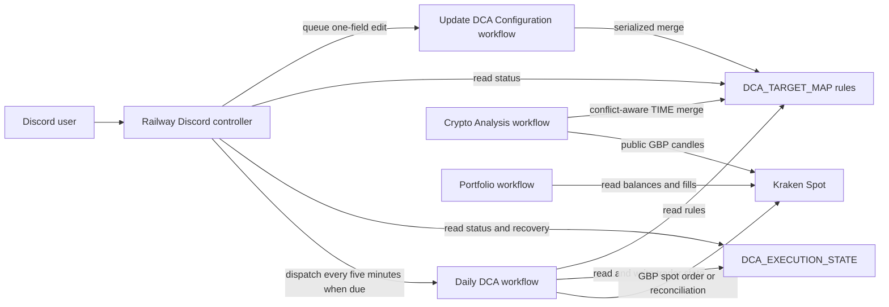
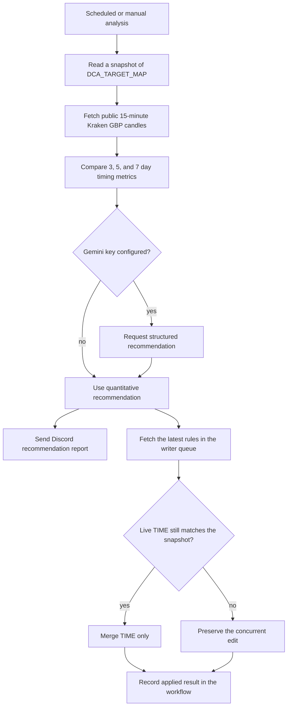
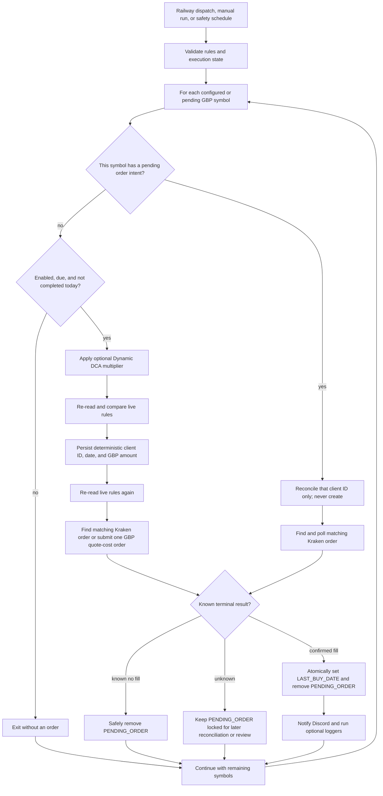
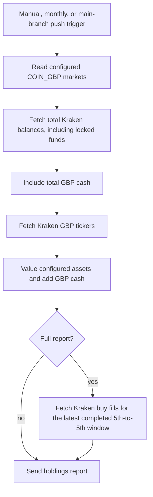

# Kraken GBP DCA Bot

This application automates GBP-denominated spot purchases on Kraken. A rule such as `BTC_GBP` targets Kraken's `BTC/GBP` market, and `AMOUNT_GBP` is submitted directly as the GBP order cost. There is no budget-currency conversion in the trading path.

Railway keeps the Discord controller and five-minute scheduler online. GitHub Actions performs analysis, trading, portfolio reporting, and serialized configuration writes. Real orders remain protected by `BUY_ENABLED`; keep every target disabled until its amount and Kraken's current market minimum have been checked.

## What each file does

| File | Role |
| --- | --- |
| `discord_bot.py` | Railway-hosted Discord interface, status reader, five-minute scheduler, and workflow dispatcher. |
| `crypto_analysis.py` | Reads public Kraken `COIN/GBP` candles, calculates timing statistics, optionally asks Gemini for a summary, and proposes `TIME` updates. |
| `crypto_dca.py` | Validates rules and execution state, manages durable order intent, runs or reconciles a Kraken buy, and records confirmed completion. |
| `kraken_client.py` | Authenticated Kraken Spot client for strict GBP symbols, deterministic order IDs, duplicate reconciliation, quote-cost orders, terminal-fill polling, and fee normalization. |
| `portfolio_balance.py` | Read-only configured-asset holdings, GBP cash, GBP valuation, and paginated monthly buy history. |
| `gist_logger.py` | Optional GBP trade log in a dedicated Gist file. |
| `portfolio_logger.py` | Optional Ghostfolio adapter. Any provider-specific conversion remains isolated from Kraken execution. |
| `.github/workflows/crypto_analysis.yml` | Scheduled or manual analysis and conflict-aware `TIME` merging. |
| `.github/workflows/daily_dca.yml` | Fail-closed due check, order execution, and pending-intent recovery. |
| `.github/workflows/update_dca_config.yml` | Serialized, one-field rule updates requested by Discord. |
| `.github/workflows/portfolio_check.yml` | Read-only portfolio reporting. |

## Where the app runs

| Component | Location | Lifetime |
| --- | --- | --- |
| Discord interface and five-minute scheduler | Railway | Continuous |
| Analysis, trading, configuration writer, and portfolio jobs | GitHub Actions | Only while a workflow runs |
| Trading rules | GitHub repository variable `DCA_TARGET_MAP` | Persistent and repository-wide |
| Execution state | GitHub repository variable `DCA_EXECUTION_STATE` | Persistent and repository-wide |
| GBP wallet and orders | Kraken | Persistent |
| Source code | GitHub branch and local clone | Persistent |

Leaving Discord open on a phone is not required. Railway keeps the bot online; Discord is only the interface used to send commands.



## Two repository variables, with separate ownership

### `DCA_TARGET_MAP`: user-managed rules

`DCA_TARGET_MAP` is a non-empty JSON object whose keys end in `_GBP`. It contains desired behavior only; it must not contain execution history or an order intent.

```json
{
  "BTC_GBP": {
    "TIME": "02:45",
    "AMOUNT_GBP": 5,
    "BUY_ENABLED": false,
    "DYNAMIC_DCA": {
      "ENABLED": false,
      "THRESHOLD_PERCENT": -2,
      "REDUCED_MULTIPLIER": 0.5
    }
  }
}
```

- `TIME` is `HH:MM` in the configured IANA timezone.
- `AMOUNT_GBP` is a direct pound order cost, not an exchange-rate input.
- `BUY_ENABLED=false` prevents new scheduled and manual buys.
- `DYNAMIC_DCA` can reduce the configured GBP cost when the optional Ghostfolio ROI rule applies.
- Unsupported symbols, missing fields, and invalid types fail closed.
- Enabled targets must be between GBP 5 and GBP 1000. A disabled target may temporarily use GBP 0 during migration.
- Kraken validates its live cost and base-amount minimum before a new order is submitted.

Discord changes only `TIME`, `AMOUNT_GBP`, or `BUY_ENABLED`. It dispatches `update_dca_config.yml`, which fetches the latest rules and applies exactly one validated field. Analysis may change only `TIME`, and skips an update if that field changed after its analysis snapshot. These writers and the trader share the `dca-target-map-writers` concurrency group with `queue: max`, so writes wait instead of cancelling one another.

### `DCA_EXECUTION_STATE`: trader-owned state

`DCA_EXECUTION_STATE` contains completion dates and any unresolved order intent. An empty object is valid and is the recommended initial value.

```json
{
  "BTC_GBP": {
    "LAST_BUY_DATE": "2026-08-04"
  }
}
```

While an order is unresolved, the trader stores a durable intent before Kraken can receive a create request:

```json
{
  "BTC_GBP": {
    "LAST_BUY_DATE": "",
    "PENDING_ORDER": {
      "client_order_id": "dca-0123456789abcd",
      "trade_date": "2026-08-04",
      "amount_gbp": 5
    }
  }
}
```

Only the trader writes this variable. Discord and the quick check read it for status, same-day suppression, and recovery dispatches. Do not hand-edit or remove `PENDING_ORDER` to force a retry: an unresolved create request may already have reached Kraken.

## End-to-end behavior

### Analysis

Kraken Spot REST exposes at most 720 recent OHLC candles. At a 15-minute interval that covers about 7.5 days, so the bot evaluates 3-, 5-, and 7-day windows on the same `COIN/GBP` market it trades. See [Kraken Get OHLC Data](https://docs.kraken.com/api-reference/market-data/get-ohlc-data).



The merge preserves amount, enabled state, and dynamic settings. It never reads or writes execution state.

### Scheduling

Railway evaluates the configured timezone on clock-aligned five-minute ticks. It selects a dispatch for enabled targets from five minutes before through sixty minutes after their target time. A temporary dispatch guard suppresses rapid duplicate workflow requests; the next state refresh confirms whether a fill completed. Any durable pending intent is dispatched for recovery even when the normal target window is not due. Once a workflow is running, the trader evaluates every symbol: pending symbols are reconciliation-only, and any other enabled, unbought target whose time has already passed may run as a same-local-day catch-up even if it is more than sixty minutes late.

GitHub also schedules `daily_dca.yml` at 22:00 UTC (05:00 Bangkok) and 16:55 UTC (23:55 Bangkok). The late run is a same-local-day catch-up if Railway missed an earlier target, while still covering targets through 23:59 within the five-minute early window. The workflow's quick check validates both JSON variables before it checks out code or loads credentials. A pending intent always causes the trader to run in recovery mode.

### Trade execution and recovery



Important safeguards:

- The executor accepts Kraken Spot `COIN/GBP` targets only.
- A deterministic 18-character client order ID identifies one market and local trade date.
- A new intent is durable before order creation. If the process stops after submission, the next run reconciles that exact ID and cannot create a replacement.
- If Kraken has no matching open or closed order for an existing intent, the outcome is treated as unknown and the intent remains locked for manual review.
- A confirmed fill and `LAST_BUY_DATE` update are one trader-state transition. If that state write fails, the pending lock remains.
- A failed or unconfirmed order is not logged as a successful purchase.
- The trader re-reads live rules before intent creation and again before submission, so an intervening disable or amount change stops a new order safely.
- There is no direct purchase command. Configuration writes require an allowlisted Discord user and the exact `!dca ` prefix; enabling also requires the exact second confirmation returned by the bot.
- The enable workflow carries the confirmed amount and time snapshot into the writer queue and refuses to enable if either changed before the queued update executes.
- Gist and Ghostfolio failures are non-blocking after a confirmed fill.
- The Kraken API key must never have withdrawal permission.

### Fee accounting

Kraken may report a fee in GBP or in the purchased asset. The normalized fields keep actual cash debit separate from a reporting equivalent:

| Field | Meaning |
| --- | --- |
| `cost_gbp` | Confirmed GBP order cost. |
| `gbp_fee_debit` | Fee actually charged from the GBP balance. |
| `fee_gbp` | GBP equivalent of all reported fee entries, regardless of fee currency. |
| `spent_gbp` / `amount_gbp` | Actual GBP balance debit: `cost_gbp + gbp_fee_debit`. |
| `received` | Gross purchased quantity minus any fee charged in the purchased asset. |

If a fee is charged in the purchased asset, its `fee_gbp` equivalent is informational. It reduces `received`; it is not added again to the GBP debit.

### Portfolio reporting



The portfolio workflow is read-only. It does not place, edit, or cancel orders, or move funds. Its total covers configured DCA assets plus GBP cash; other Kraken assets are identified as excluded.

## GitHub Actions

| Workflow | Trigger | Result |
| --- | --- | --- |
| `crypto_analysis.yml` | Daily at 21:00 UTC or manual | Analyzes Kraken GBP markets and conflict-checks `TIME` recommendations against the latest rules. |
| `daily_dca.yml` | Railway dispatch, manual, or fallback schedules at 22:00 and 16:55 UTC | Validates both variables, reconciles pending intents, and trades only when otherwise due and enabled. |
| `update_dca_config.yml` | Discord workflow dispatch | Applies one validated rule field against the latest map through the shared writer queue. |
| `portfolio_check.yml` | Manual, monthly on the 5th at 00:00 UTC, or push to `main` | Sends a read-only Kraken portfolio report in GBP. |

GitHub schedules always use the workflow from the repository's default branch. A feature branch can be dispatched manually, but its schedule does not become production until it is merged.

## Required setup

### Kraken API permissions

Use one API key with only the permissions the bot needs:

- Query Funds
- Query Open Orders & Trades
- Query Closed Orders & Trades
- Create & Modify Orders

Do not grant Withdraw Funds. Without portfolio permissions, balance and history reports fail; without order permission, buys fail safely.

### GitHub repository secrets

| Secret | Use |
| --- | --- |
| `KRAKEN_API_KEY` | Kraken authentication. |
| `KRAKEN_API_SECRET` | Kraken signing secret. |
| `DISCORD_WEBHOOK_URL` | Analysis, execution, and portfolio notifications. |
| `GEMINI_API_KEY` | Optional AI analysis and Railway command classification. |
| `GH_PAT_FOR_VARS` | Serialized rule writes, trader-state writes, and optional Gist logging. |
| `GIST_ID` | Optional GBP trade-log Gist. |
| `GHOSTFOLIO_TOKEN` | Optional Ghostfolio logging and Dynamic DCA ROI. |

### GitHub repository variables

| Variable | Owner and use |
| --- | --- |
| `DCA_TARGET_MAP` | User-managed GBP targets and rules; Discord and analysis use serialized writers. |
| `DCA_EXECUTION_STATE` | Trader-owned completion dates and durable pending intents; initialize to `{}`. |
| `TIMEZONE` | IANA timezone, default `Asia/Bangkok`. |
| `GHOSTFOLIO_URL` | Optional Ghostfolio base URL. |
| `PORTFOLIO_ACCOUNT_MAP` | Optional JSON map from base asset to Ghostfolio account ID. |

### Railway variables

| Variable | Use |
| --- | --- |
| `DISCORD_BOT_TOKEN` | Discord bot login. |
| `GEMINI_API_KEY` | Natural-language command classifier. |
| `GH_PAT` | GitHub workflow dispatch and repository-variable reads. |
| `GITHUB_REPO` | `owner/repository`. |
| `GITHUB_WORKFLOW_REF` | Branch dispatched by Railway, such as `codex/kraken-gbp` during review or `main` after merge. |
| `DISCORD_CHANNEL_ID` | Optional single allowed channel. |
| `DISCORD_ALLOWED_USERS` | Comma-separated user IDs allowed to run actions. |
| `DCA_CRON_ENABLED` | `true` enables Railway's five-minute dispatcher. |
| `TIMEZONE` | Same timezone as the repository workflows. |

Kraken credentials are not required in Railway. Railway dispatches GitHub Actions; authenticated trading and portfolio calls happen in those jobs.

## Discord interface

Examples:

- `show status`
- `!dca set BTC amount to 25 pounds`
- `!dca set BTC time to 02:45`
- `!dca disable BTC`
- `!dca enable BTC`, followed by the bot's exact confirmation command
- `!dca analyze BTC`
- `check portfolio`

The Discord and execution guardrails accept GBP 5 through GBP 1000 for enabled targets; Kraken's live per-market minimum remains authoritative. A successful configuration reply means the change was queued, not yet applied. Direct purchase commands are intentionally unavailable.

## Optional logging

- Gist rows contain order cost, actual GBP fee debit, total fee GBP equivalent, total GBP debit, GBP unit prices, net received quantity, Kraken order ID, and Ghostfolio status.
- Ghostfolio is optional. Its fee field uses the economic fee equivalent while the comment preserves the actual GBP cash debit. Any provider conversion occurs only inside the adapter and never changes the Kraken order, rules, Gist GBP values, Discord result, or portfolio report.

## Local verification

```powershell
$env:PYTHONUTF8 = "1"
.venv\Scripts\python.exe -m unittest discover -s tests -v
.venv\Scripts\python.exe -m py_compile crypto_analysis.py crypto_dca.py discord_bot.py gist_logger.py kraken_client.py portfolio_balance.py portfolio_logger.py
```

Docker is only needed to reproduce the Railway Discord service locally:

```powershell
docker build -t dca-discord-bot .
```

Do not run a second Discord instance while Railway is connected with the same bot token.

## Safe post-merge migration

Repository variables are shared by every branch, while scheduled workflows run from the default branch. Migrate only after the new code is merged, and keep all trading disabled throughout:

1. Set Railway `DCA_CRON_ENABLED=false` and confirm no target is enabled before the merge.
2. Merge the reviewed branch so the default branch contains the split rules/state validation and pending-intent safeguards.
3. Set `DCA_TARGET_MAP` to the canonical `COIN_GBP` / `AMOUNT_GBP` schema above with every `BUY_ENABLED` value `false`. Do not include `LAST_BUY_DATE` or `PENDING_ORDER` in this variable.
4. Create `DCA_EXECUTION_STATE` if it does not exist. Migrate each existing `LAST_BUY_DATE` from the old rules into this variable, and preserve any state already present. Use `{}` only when Kraken history and the previous automation state confirm there is no unresolved order and no same-local-day fill that must remain suppressed. Never reset existing state merely to simplify migration.
5. Point Railway `GITHUB_WORKFLOW_REF` to `main`, redeploy it, and confirm status shows the expected GBP rules and execution state.
6. Run the read-only portfolio workflow and a manual disabled `daily_dca.yml` check. The disabled trade run should stop before Kraken authentication.
7. Re-enable the Railway scheduler while targets remain disabled.
8. Set the intended GBP amount, verify Kraken's live minimum, then enable one target using the exact two-step Discord confirmation.

No real trade is required to validate deployment.
