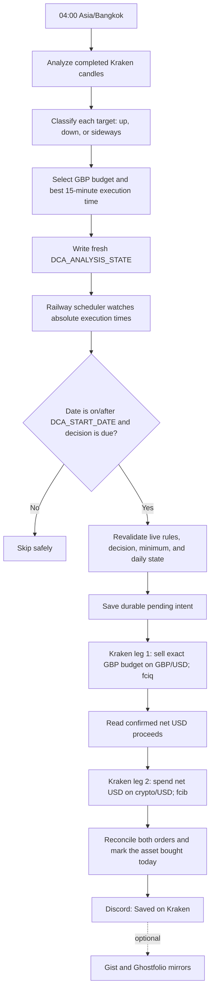
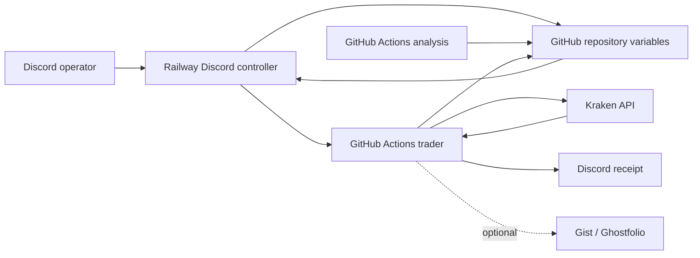

# Kraken GBP-Funded USD DCA Bot

This repository is the production source for a fully automated Kraken spot DCA
service. It tracks and buys exactly these USD markets:

- `BTC/USD`
- `HYPE/USD`
- `SOL/USD`

Budgets remain denominated in GBP. At execution time the bot first sells the
selected GBP budget on Kraken's `GBP/USD` market, then spends the confirmed net
USD proceeds on the selected crypto/USD market. There is no THB or Bitkub path.

Kraken is the authoritative record of cash, holdings, fees, and orders. Gist and
Ghostfolio are optional post-fill mirrors; an unavailable optional logger never
means the Kraken portfolio was not saved.

## Production configuration

Production begins on **2026-08-07 in Asia/Bangkok**. The repository variable
`DCA_START_DATE` must contain the strict value `2026-08-07`. Before that local
date, the trader fails closed without creating either Kraken order.

The requested enabled rules are:

```json
{
  "BTC_USD": {
    "REGIME_AMOUNTS_GBP": {"LOW": 10, "UP": 20},
    "BUY_ENABLED": true
  },
  "HYPE_USD": {
    "REGIME_AMOUNTS_GBP": {"LOW": 10, "UP": 15},
    "BUY_ENABLED": true
  },
  "SOL_USD": {
    "REGIME_AMOUNTS_GBP": {"LOW": 5, "UP": 15},
    "BUY_ENABLED": true
  }
}
```

Downtrends and sideways markets use `LOW`; uptrends use `UP`. Aggregate daily
exposure is £25 when all three targets select `LOW`, and at most £50 when all
three select `UP`. Each enabled asset can buy at most once per Bangkok calendar
day.

## Automated daily flow



`fciq` requests the GBP/USD fee in quote currency; `fcib` requests the crypto
order fee in the purchased base asset. The bot uses confirmed Kraken fills—not
an estimated conversion—to determine how much USD is available for leg two.

If either result is unknown, the durable intent remains pending and later runs
reconcile it before considering another order. The bot never starts a second
funding leg merely because an API response was interrupted.

## Trend and timing decisions

Analysis runs daily at 04:00 Bangkok time and uses completed Kraken candles only.

- `UPTREND`: two consecutive daily closes above SMA150, EMA20 above EMA50,
  completed weekly close above weekly EMA20, and a positive 20-day SMA150 slope.
- `DOWNTREND`: the inverse conditions.
- `SIDEWAYS`: every other valid result.
- `UPTREND` selects `UP`; `DOWNTREND` and `SIDEWAYS` select `LOW`.

The execution-time engine deterministically evaluates completed 15-minute data
over 3-, 5-, and 7-day windows. A decision contains an absolute `EXECUTE_AT`, is
valid only for its stated window, and must be at least 30 minutes after analysis.
Gemini may explain the result but cannot choose the regime, budget, or time.

Insufficient, stale, missing, or failed analysis sets that target to `ERROR`,
alerts Discord, and skips the purchase. Old decisions are never reused.

## Architecture



Railway runs `python3 -u discord_bot.py` continuously. It owns the five-minute
scheduler and dispatches GitHub Actions at each asset's absolute decision time.
GitHub Actions holds the Kraken credentials and performs authenticated analysis,
configuration writes, read-only portfolio checks, and trading. Discord can be
closed on every phone and computer without stopping automation.

## State and repository variables

`DCA_TARGET_MAP` contains only the three exact target keys, their `LOW`/`UP` GBP
budgets, and `BUY_ENABLED` flags. Budget edits are atomic and permitted only
while the selected asset is disabled.

`DCA_ANALYSIS_STATE` stores each asset's status, regime, selected tier,
`EXECUTE_AT`, `VALID_UNTIL`, `DECISION_ID`, `RULES_HASH`, signal metrics, and
timing metrics.

`DCA_EXECUTION_STATE` stores `LAST_BUY_DATE` and durable `PENDING_ORDER` state,
including the originating decision and both legs of the GBP-funded USD purchase.

Required repository variables:

- `DCA_TARGET_MAP`
- `DCA_ANALYSIS_STATE`
- `DCA_EXECUTION_STATE`
- `DCA_START_DATE` (`2026-08-07` for this rollout)
- `DCA_CRON_ENABLED`
- `TIMEZONE` (`Asia/Bangkok`)

Optional repository variables:

- `GHOSTFOLIO_URL`
- `PORTFOLIO_ACCOUNT_MAP`

Required GitHub Actions secrets:

- `KRAKEN_API_KEY`
- `KRAKEN_API_SECRET`
- `DISCORD_WEBHOOK_URL`
- `GH_PAT_FOR_VARS`

Optional secrets:

- `GEMINI_API_KEY`
- `GIST_ID`
- `GIST_TOKEN`
- `GHOSTFOLIO_TOKEN`

Kraken API credentials must allow query and order operations but must never have
withdrawal permission. Production JSON state is loaded inside workflow steps,
masked line-by-line, and passed through the GitHub environment file. Workflows
must never print a complete rules, analysis, or execution-state document.

## Discord controls

Examples use canonical USD targets:

```text
!dca set BTC amounts to 10 low and 20 up
!dca disable BTC
!dca enable BTC
!dca confirm enable BTC_USD
!dca analyze BTC
!dca analyze all
show status
!dca health
```

Budget changes require the target to be disabled. Enabling requires exact
confirmation and displays both budgets, the latest regime, effective amount,
next execution time, decision age, and aggregate maximum daily exposure.

## Workflows

| Workflow | Trigger | Responsibility |
| --- | --- | --- |
| `crypto_analysis.yml` | Daily 04:00 Bangkok or manual | Build fresh decisions for BTC/USD, HYPE/USD, and SOL/USD. |
| `daily_dca.yml` | Railway dispatch | Enforce `DCA_START_DATE`, revalidate state, and execute due two-leg purchases. |
| `portfolio_check.yml` | Monthly or manual | Read-only Kraken holdings and USD-market history, valued in GBP with live Kraken GBP/USD. |
| `update_dca_config.yml` | Manual/Discord dispatch | Serialize atomic GBP budget and enable-state updates. |
| `ci.yml` | Pull request and `main` | Compile, test, validate workflows, and build the Railway image. |

## Safe rollout and verification

1. Keep all targets disabled while setting final rules and empty/fresh state.
2. Set `DCA_START_DATE=2026-08-07` and confirm `TIMEZONE=Asia/Bangkok`.
3. Run the read-only portfolio workflow and confirm BTC/USD, HYPE/USD, SOL/USD,
   GBP cash, USD cash, and the live GBP/USD conversion appear.
4. Run analysis and confirm three fresh decisions and three Discord summaries.
5. Run the trader while disabled and verify no Kraken `AddOrder` call occurs.
6. Enable each target with exact confirmation after Kraken minimum validation.
7. Re-enable Railway scheduling and verify `show status` and `!dca health`.
8. Confirm Railway reports the deployed `main` commit and its scheduler is on.

Acceptance requires no pending intents, no same-day duplicate orders, three
fresh decisions, and no credential or complete production-state JSON in public
logs. No manual intervention is required after activation.

## Local verification

```bash
python -m compileall -q .
python -m unittest discover -s tests -v
docker build --tag dca-bot-local .
```
