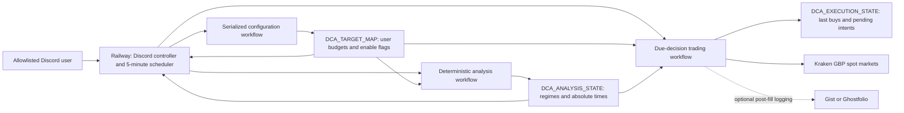
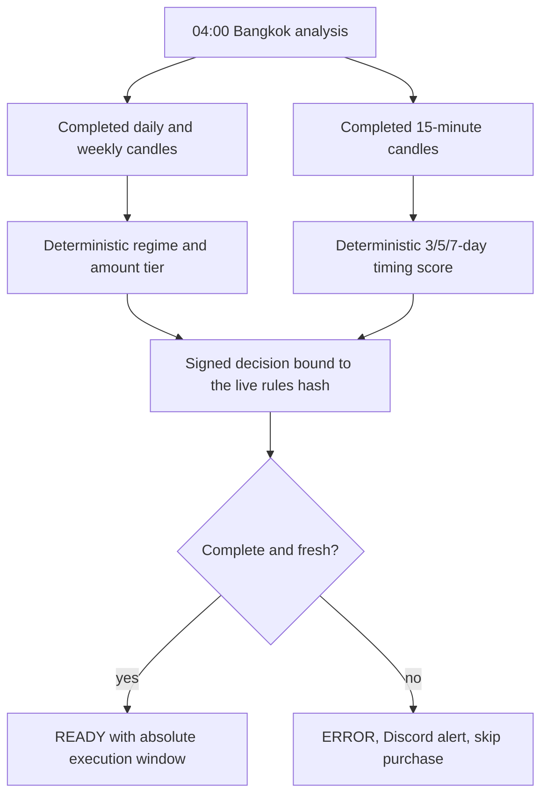
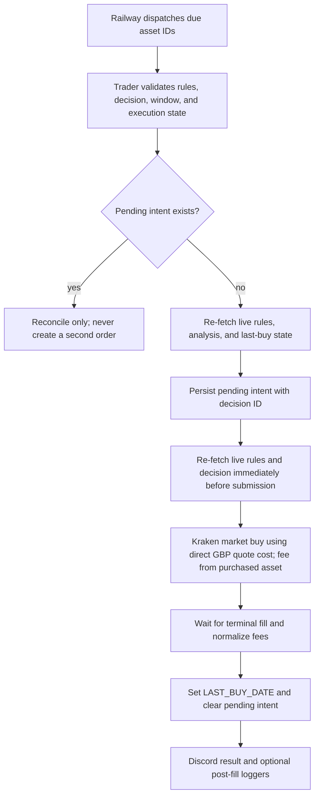

# Kraken GBP DCA Bot

This repository is the production source for a cloud-hosted Discord DCA bot. It trades only Kraken spot markets quoted in GBP: `BTC/GBP`, `ETH/GBP`, `SOL/GBP`, and `ADA/GBP`.

There is no THB conversion, Bitkub path, ROI-controlled spend, or direct Discord buy command. User-owned GBP budgets select the spend after a deterministic market-regime decision. Gemini may explain a result, but it cannot choose the regime, amount, or execution time.

## Where it runs

The Discord controller and five-minute scheduler run continuously on Railway. GitHub Actions performs market analysis, configuration writes, portfolio checks, and authenticated Kraken execution. Kraken credentials stay in GitHub Actions; Railway never receives them. Discord can be closed on every phone and computer without stopping the worker.



The production deployment follows `main`. Changes are developed on a branch, checked by CI, merged through a pull request, and then automatically deployed by Railway.

## The three persistent state documents

### User-owned rules

`DCA_TARGET_MAP` contains exactly four entries. Disabled targets may use zero while they are being configured. Enabling requires both budgets to be from £5 through £1,000 and at or above Kraken's current market minimum.

```json
{
  "BTC_GBP": {
    "REGIME_AMOUNTS_GBP": {
      "LOW": 0,
      "UP": 0
    },
    "BUY_ENABLED": false
  },
  "ETH_GBP": {
    "REGIME_AMOUNTS_GBP": {
      "LOW": 0,
      "UP": 0
    },
    "BUY_ENABLED": false
  },
  "SOL_GBP": {
    "REGIME_AMOUNTS_GBP": {
      "LOW": 0,
      "UP": 0
    },
    "BUY_ENABLED": false
  },
  "ADA_GBP": {
    "REGIME_AMOUNTS_GBP": {
      "LOW": 0,
      "UP": 0
    },
    "BUY_ENABLED": false
  }
}
```

Budget changes are atomic: LOW and UP are changed together, and only while that target is disabled. A budget change invalidates the old analysis fingerprint, so the target must be analyzed again before it can be enabled.

### Analysis decisions

`DCA_ANALYSIS_STATE` is generated by analysis, not edited by users. Each asset has `STATUS`, `REGIME`, `AMOUNT_TIER`, `EXECUTE_AT`, `VALID_UNTIL`, `DECISION_ID`, `RULES_HASH`, `SIGNALS`, and `TIMING`.

```json
{
  "VERSION": 1,
  "GENERATED_AT": "2026-08-05T21:00:00Z",
  "TARGETS": {
    "BTC_GBP": {
      "STATUS": "READY",
      "REGIME": "SIDEWAYS",
      "AMOUNT_TIER": "LOW",
      "EXECUTE_AT": "2026-08-06T02:15:00Z",
      "VALID_UNTIL": "2026-08-06T03:15:00Z",
      "DECISION_ID": "example-decision-id",
      "RULES_HASH": "64-character-lowercase-sha256",
      "SIGNALS": {},
      "TIMING": {
        "ANALYZED_AT": "2026-08-05T21:00:00Z"
      }
    }
  }
}
```

The real state always contains all four targets. Missing, insufficient, stale, or failed analysis produces an `ERROR` target, sends a Discord alert, and cannot be reused for a purchase.

### Execution state

`DCA_EXECUTION_STATE` is trader-owned. `LAST_BUY_DATE` enforces one purchase per asset per Asia/Bangkok calendar day. A durable `PENDING_ORDER` is saved before Kraken submission and includes its originating `decision_id` so ambiguous requests can be reconciled without duplicating an order.

Never hand-edit or delete a pending intent to force a retry. Inspect Kraken first.

## Deterministic analysis

Analysis runs daily at 04:00 Asia/Bangkok and ignores every incomplete candle.

The daily/weekly regime rules are:

- `UPTREND`: on two consecutive completed daily candles, close is above SMA150 and EMA20 is above EMA50; the completed weekly close is above weekly EMA20; and the SMA150 20-day slope is positive.
- `DOWNTREND`: the exact inverse conditions.
- `SIDEWAYS`: everything else.

`UPTREND` selects the UP budget. `DOWNTREND` and `SIDEWAYS` select the LOW budget.

For timing, the latest 672 contiguous completed 15-minute Kraken candles are split into rolling 24-hour blocks and scored over 3-, 5-, and 7-day windows. This remains inside Kraken's 720-row OHLC limit even when analysis is run manually later in the Bangkok day. The Python engine applies fixed median-miss, win-rate, recency-override, and tie-break rules. `EXECUTE_AT` is the next selected occurrence at least 30 minutes after analysis. The purchase window opens five minutes before it and closes 60 minutes after it.



## Discord controls

Mutating commands require the configured channel, an allowlisted user, and the exact `!dca ` prefix.

```text
!dca set BTC amounts to 10 low and 20 up
!dca disable BTC
!dca enable BTC
!dca analyze BTC
!dca analyze all
show status
!dca health
```

`!dca enable BTC` returns an exact confirmation phrase. The review shows both budgets, the latest regime, effective amount, next execution time, decision age, and maximum aggregate daily exposure. The serialized writer re-fetches the rules, decision, and execution state; compares the target and global four-asset fingerprints; blocks while any pending Kraken reconciliation exists; and checks Kraken's live minimum before setting `BUY_ENABLED=true`.

There is no command that places an immediate order.

## Execution safety



The trader fails closed on stale/error decisions, a missed window, a rules-hash change, a decision-ID change, an already-bought date, an unresolved pending order, or an unprovable Kraken minimum. Kraken is asked to charge the fee from the purchased base asset, and cost precision is rejected if it would raise the GBP cash debit above the selected budget. Gist and Ghostfolio run only after a confirmed fill and cannot change spend.

## GitHub Actions

| Workflow | Trigger | Responsibility |
|---|---|---|
| `ci.yml` | Pull request and push to `main` | Compile, run unit tests, validate workflow YAML, and build the Railway image without production credentials. |
| `crypto_analysis.yml` | Daily at 21:00 UTC or manual | Produce four deterministic decisions and Discord summaries. |
| `daily_dca.yml` | Railway dispatch or manual | Revalidate live state, reconcile pending intents, and submit only due enabled decisions. |
| `update_dca_config.yml` | Discord dispatch or manual | Atomically update both budgets, toggle an enable flag, or validate a dry run. |
| `portfolio_check.yml` | Monthly or manual | Read-only Kraken portfolio reporting for the four configured GBP markets. |

Each durable document has its own `queue: max` writer group: rule changes serialize with rule changes, analysis writes with analysis writes, and execution-state changes with trader runs. The groups remain separate so a disable can be applied while a trader is running and caught by its final live-state check.

## Production configuration

GitHub Actions secrets:

- `KRAKEN_API_KEY` and `KRAKEN_API_SECRET`: query and order permissions only; never withdrawal permission.
- `GH_PAT_FOR_VARS`: repository-variable reads and writes only.
- `DISCORD_WEBHOOK_URL`: workflow reports and alerts.
- `GEMINI_API_KEY`: optional explanation text.
- `GIST_ID` and `GIST_TOKEN`: optional post-fill logging.
- `GHOSTFOLIO_TOKEN`: optional post-fill logging.

GitHub repository variables:

- `DCA_TARGET_MAP`
- `DCA_ANALYSIS_STATE`
- `DCA_EXECUTION_STATE`
- `TIMEZONE=Asia/Bangkok`
- Optional `GHOSTFOLIO_URL` and `PORTFOLIO_ACCOUNT_MAP`

Railway variables:

- `DISCORD_BOT_TOKEN`
- `DISCORD_CHANNEL_ID`
- `DISCORD_ALLOWED_USERS`
- `GH_PAT`
- `GITHUB_REPO=aesscialo-bot/DCA-Bot`
- `GITHUB_WORKFLOW_REF=main`
- `TIMEZONE=Asia/Bangkok`
- `DCA_CRON_ENABLED=true|false`
- Optional `GEMINI_API_KEY`

## Safe release sequence

1. Set Railway `DCA_CRON_ENABLED=false`.
2. Confirm all four rules are disabled and inspect Kraken for bot-tagged open or same-day orders.
3. Run CI on a pull request and merge only when it is green.
4. Confirm Railway deployed the exact merge SHA from `main`.
5. Install the final rules, analysis, and execution schemas while scheduling remains off.
6. Run the portfolio workflow, four-asset analysis, disabled trader, and configuration-writer dry run.
7. Confirm Railway reports Discord connected, four valid targets, and its scheduler state.
8. Set `DCA_CRON_ENABLED=true` while every `BUY_ENABLED` value is still false.
9. Set budgets through Discord, analyze that asset again, review the exposure, and use the exact enable confirmation only when ready.

## Local verification

Use Python 3.12:

```powershell
python -m pip install -r requirements.txt -r bot_requirements.txt
python -m compileall -q .
python -m unittest discover -s tests -v
docker build -t dca-bot-local .
```

Do not run a second Discord worker with the production bot token while Railway is connected.
